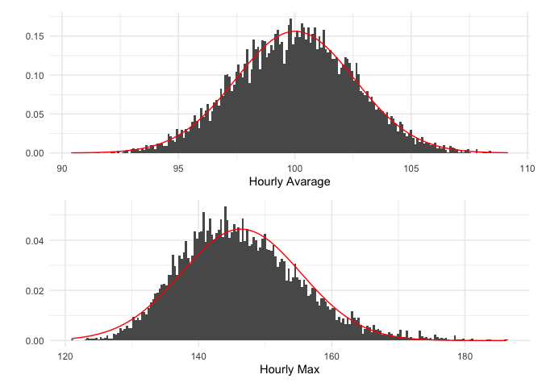

Max is not Normal
================
Peter Rabinovitch
2024-07-14 16:02:12.852435

<details>
<summary>
Code
</summary>

``` r
library(tidyverse)
library(patchwork)
```

</details>

# Introduction

Recently I have seen a number of systems that attempt to detect
anomalies, whether it be in the number of transactions, the time to
download a web page, or the sales of a product.

Of course this is a good thing to do - to make sure that if anything is
out of whack that you are alerted and can investigate and take
appropriate action.

A common theme among these systems is the trade-off between false alarms
and missing true anomalies. One approach that seems ubiquitous is that
of comparing the current value to historical values and alerting of the
current value falls outside some interval. Usually this is based on
(some variant of) a t-test, and looks at (typically) a 95% confidence
interval as determined by the mean +/- 1.96 \* the standard deviation of
the historical data.

What isn’t so good is applying the same statistical approach to the
maximum (or minimum). Here we expand on the title of this post: the
maximum is not normally (Gaussian) distributed, and so systems that look
at the average maximum over history and compare it to the current
maximum and alert if the current values falls outside +/1.96 sd’s, is
not correct.

# Illustration

Here we show what goes wrong.

<details>
<summary>
Code
</summary>

``` r
set.seed(2024)
d <- 365 # days
hpd <- 24 # hours per day
nph <- 60 # number of data points per hour
mu <- 100 # mean of the data points
sigma <- 20 # sd of the data points

df <- tibble(x = rnorm(d * hpd * nph, mu, sigma)) %>%
  rowid_to_column() %>%
  mutate(h = ceiling(rowid / nph)) # sample of the data

dg <- df %>% # look at it on an hourly basis
  group_by(h) %>%
  summarize(M = max(x), s = sum(x), m = mean(x), v = var(x), .groups = "drop")

# plot the data & fom's
al <- 0.1

p1 <- dg %>% ggplot(aes(x = h, y = m)) +
  geom_point(alpha = al) +
  theme_minimal() +
  labs(x = "", y = "Hourly Average") +
  scale_x_continuous(label = scales::comma) +
  scale_y_continuous(label = scales::comma)

p2 <- dg %>% ggplot(aes(x = h, y = M)) +
  geom_point(alpha = al) +
  theme_minimal() +
  labs(x = "Hour", y = "Hourly Max") +
  scale_x_continuous(label = scales::comma) +
  scale_y_continuous(label = scales::comma)
```

</details>

<!-- -->

We plot the hourly average of some figure of merit (fom), as well as the
maximum of the fom, by hour.

Next we show the distributions of these values, along with their best
fitting Gaussian distribution in red.

<details>
<summary>
Code
</summary>

``` r
# plot the histograms & best Gaussian to the data
nb <- 200

p1 <- ggplot() +
  geom_histogram(data = dg, aes(x = m, y = after_stat(density)), bins = nb) +
  geom_function(fun = dnorm, args = list(mean = mean(dg$m), sd = sd(dg$m)), colour = "red") +
  theme_minimal() +
  scale_x_continuous(labels = scales::comma) +
  labs(x = "Hourly Avarage", y = "")

p2 <- ggplot() +
  geom_histogram(data = dg, aes(x = M, y = after_stat(density)), bins = nb) +
  geom_function(fun = dnorm, args = list(mean = mean(dg$M), sd = sd(dg$M)), colour = "red") +
  theme_minimal() +
  labs(x = "Hourly Max", y = "")
```

</details>

<!-- -->

The hourly average is very well approximated by a Gaussian, but the
hourly maximum is not as well fitted. So, of course, any alarm based on
a rule designed for a Gaussian distribution would not be correct for the
maximum, because it is not Gaussian distributed.

# Conclusion

Don’t blindly apply formulae that you don’t really understand. Get out
your stats text (or Wikipedia) or talk to someone who knows more.

# Appendices

<details>
<summary>
References
</summary>

[Wikipedia post on Extreme Value
Theory](https://en.wikipedia.org/wiki/Extreme_value_theory)

</details>
<details>
<summary>
SessionInfo
</summary>

``` r
sessionInfo()
```

    ## R version 4.4.0 (2024-04-24)
    ## Platform: x86_64-apple-darwin20
    ## Running under: macOS Ventura 13.4
    ## 
    ## Matrix products: default
    ## BLAS:   /Library/Frameworks/R.framework/Versions/4.4-x86_64/Resources/lib/libRblas.0.dylib 
    ## LAPACK: /Library/Frameworks/R.framework/Versions/4.4-x86_64/Resources/lib/libRlapack.dylib;  LAPACK version 3.12.0
    ## 
    ## locale:
    ## [1] en_US.UTF-8/en_US.UTF-8/en_US.UTF-8/C/en_US.UTF-8/en_US.UTF-8
    ## 
    ## time zone: America/Toronto
    ## tzcode source: internal
    ## 
    ## attached base packages:
    ## [1] stats     graphics  grDevices utils     datasets  methods   base     
    ## 
    ## other attached packages:
    ##  [1] patchwork_1.2.0 lubridate_1.9.3 forcats_1.0.0   stringr_1.5.1  
    ##  [5] dplyr_1.1.4     purrr_1.0.2     readr_2.1.5     tidyr_1.3.1    
    ##  [9] tibble_3.2.1    ggplot2_3.5.1   tidyverse_2.0.0
    ## 
    ## loaded via a namespace (and not attached):
    ##  [1] gtable_0.3.5      highr_0.10        compiler_4.4.0    tidyselect_1.2.1 
    ##  [5] scales_1.3.0      yaml_2.3.8        fastmap_1.2.0     R6_2.5.1         
    ##  [9] labeling_0.4.3    generics_0.1.3    knitr_1.46        munsell_0.5.1    
    ## [13] pillar_1.9.0      tzdb_0.4.0        rlang_1.1.3       utf8_1.2.4       
    ## [17] stringi_1.8.4     xfun_0.44         timechange_0.3.0  cli_3.6.2        
    ## [21] withr_3.0.0       magrittr_2.0.3    digest_0.6.35     grid_4.4.0       
    ## [25] rstudioapi_0.16.0 hms_1.1.3         lifecycle_1.0.4   vctrs_0.6.5      
    ## [29] evaluate_0.23     glue_1.7.0        farver_2.1.2      fansi_1.0.6      
    ## [33] colorspace_2.1-0  rmarkdown_2.27    tools_4.4.0       pkgconfig_2.0.3  
    ## [37] htmltools_0.5.8.1

</details>
